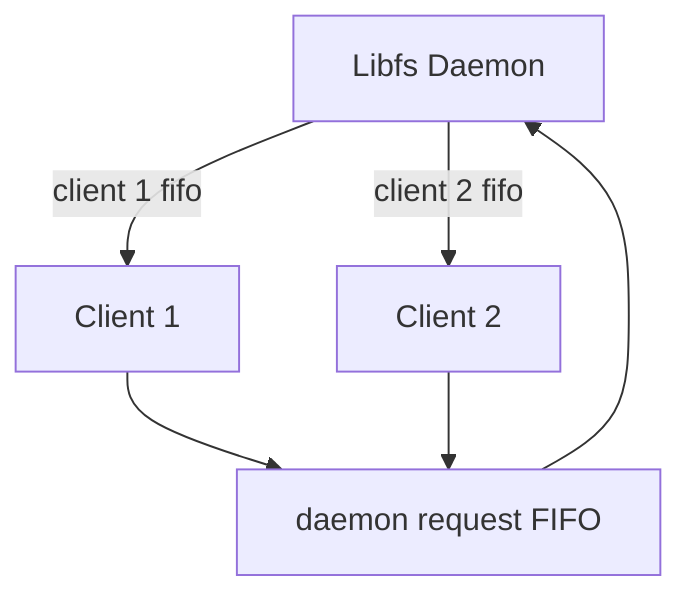
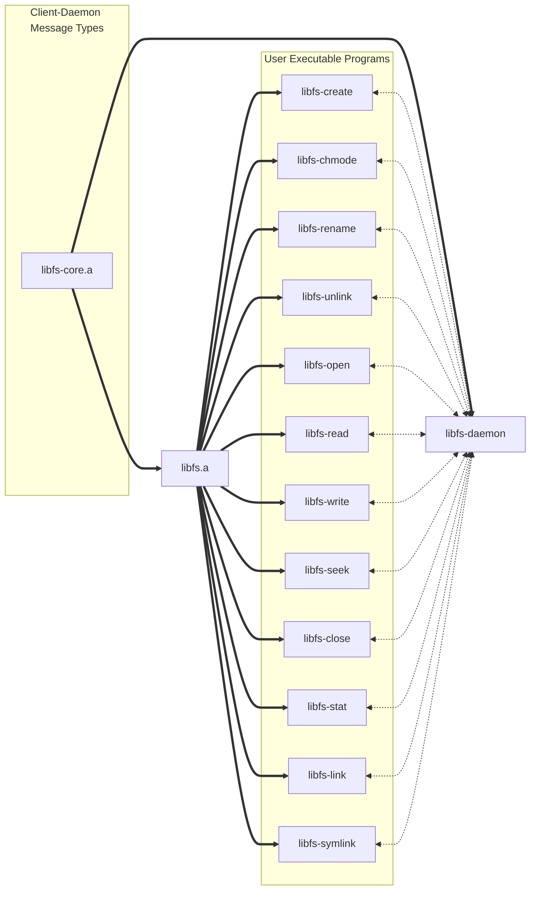

# Temat zadania

Napisać bibliotekę implementującą prosty system plików z operacjami zdefiniowanymi niżej.

Wariant: **W11 + W22**

## Założenia podstawowe:

- Biblioteka statyczna (.o lub .a), nagłówek .h oraz serwis (demon) [można też zrealizować jako bibliotekę .so]
- Pliki przechowywane są w jednym katalogu (struktura płaska, brak podkatalogów)
- Tylko pliki zwykłe (regular)
- Funkcje (działanie funkcji wynika z jej nazwy przez analogię do podobnej funkcji systemowej):

```c
fd_type libfs_create(char *name, long mode); // libfs_open nie tworzy pliku

int libfs_chmode(char *name, long mode);

int libfs_rename(char *oldname, char *newname);

int libfs_unlink(char *name);

fd_type libfs_open(char *name, int flags); // flagi: O_RD, O_WR, O_RDWR

int libfs_read(fd_type fd, char *buf, unsigned int size);

int libfs_write(fd_type fd, char *buf, unsigned int size);

int libfs_seek(fd_type fd, long int offset); // offset + lub - od akt. pozycji

int libfs_close(fd_type fd);
```

- Dodatkowo:
    - Kod powrotu - analogicznie do funkcji systemowych, dodatkowo zmienna `libfs_errno` powinna być ustawiana analogicznie do tego, jak dzieje się to dla zmiennej `errno`.
    - W razie wątpliwości dotyczących zachowania danej funkcji, należy przyjąć w miarę możności zachowanie maksymalnie zbliżone do odpowiadającej funkcji systemowej.
    - O ile w wariancie nie podano inaczej, kontrola praw dostępu odbywa się poprzez standardowe mechanizmy systemu, demon działa z tymi samymi uprawnieniami co użytkownik. Obsługę uprawnień należy przeanalizować i opisać.
    - Pliki mogą (ale nie muszą) być przechowywane w dedykowanym katalogu demona (alternaywnie: w pamięci).

## Wariant implementacyjny
Implementację komunikacji pomiedzy biblioteką a serwisem należy zrealizować poprzez **potoki nazwane (FIFO)**


## Wariant funkcjonalny
Dodatkowo należy zaimplementować:

- Dodać obsługę funkcji typu `stat()` oraz wynikających z niej atrybutów: wielkości, znaczników czasu.
- Dodać obsługę funkcji analogicznej do `link()`/`symlink()`

## Testowanie
Testy wymagają napisania programu lub programów (i ewentualnie skryptów) pokrywajacych funkcjonalność, przypadki brzegowe, obsługę błędów, itp.

Testy mogą zawierać prosty tekstowy interpreter pozwalający na uruchamianie poszczególnych funkcji w trybie konwersacyjnym. Dozwolone jest też napisanie szeregu prostych programów testowych, w takim przypadku zalecane jest stworzenie skryptów parametryzujących różne wywołania takich programów.

### Miejsce realizacji:

Dowolny system Unix/Linux zgodny z POSIX

# Interpretecja treści zadania

<!-- Interpretację treści zadania (tj. doprecyzowanie treści), w tym definicje i opisy wymaganych i dodatkowych funkcji. -->

Pliki oraz operacje na plikach są obsługiwane za pośrednictwem *demona*. Serwis przechowywuje pliki w określonej z góry lokalizacji na dysku. Jest ona unikalna dla użytkownika, tworzona w jego katalogu domowym w ukrytym katalogu `$HOME/.local/share/libfs`. Biblioteka udostępnia podstawowy interfejs oraz realizuje komunikację z demonem poprzez nazwane kolejki.

## Opisy funkcji
<!-- wymaganych oraz dodatkowych -->

**Stwórz plik lub nadpisz istniejący**
```c
fd_type libfs_create(char *name, long mode);
```

**Zmień uprawnienia do pliku**
```c
int libfs_chmode(char *name, long mode);
```

**Zmień nazwę pliku**
```c
int libfs_rename(char *oldname, char *newname);
```

**Usuń nazwę i ewentualnie plik, do którego się odnosi**
```c
int libfs_unlink(char *name);
```

**Otwórz isniejący plik**

Funkcja `libfs_open` nie jest odpowiedzialna za utworzenie pliku.

```c
fd_type libfs_open(char *name, int flags);
```

**Odczyt z pliku wskazywanego przez deskryptor**

```c
int libfs_read(fd_type fd, char *buf, unsigned int size);
```

**Zapis do pliku wskazywanego przez deskryptor**

```c
int libfs_write(fd_type fd, char *buf, unsigned int size);
```

**Zmień położenie przesunięcia w czasie odczytu/zapisu do pliku**

Położenie zmieniane relatywnie do aktualnej pozycji w źródle.

```c
int libfs_seek(fd_type fd, long int offset);
```

**Zamknięcie deskryptora pliku**

```c
int libfs_close(fd_type fd);
```

**Pobranie statusu pliku**

`struct libfs_stat_t` jest okrojoną wersją `struct stat` ze standardów. Usunięte są pola nam niepotrzebne, np. device ID lub user ID bądź group ID. Zakładamy że nasz system plików jest płaski, tzn. bez podkatalogów i istnieje w predefiniowanym miejscu na dysku. Jako że daemon pracuje z uprawnieniami użytkownika wykonującego do niego zapytania, pliki użytkownika biblioteki muszą znajdować się w miejscu w pełni dostępnym dla daemona, co ogranicza nas do `$HOME` użytkownika. Dane te byłyby więc stałe między plikami.

Nie powielamy informacji o plikach w pamięci demona - `libfs_stat` jedynie mapuje istniejącą informację o pliku z systemu plików na naszą strukturę zdefiniowaną w bibliotece.

```c
struct libfs_stat_t {
   ino_t     st_ino;         /* System Inode number */
   mode_t    st_mode;        /* File type and mode */
   nlink_t   st_nlink;       /* Number of hard links */
   off_t     st_size;        /* Total size, in bytes */
   blksize_t st_blksize;     /* Block size for filesystem I/O */
   blkcnt_t  st_blocks;      /* Number of 512B blocks allocated */

   struct timespec st_atim;  /* Time of last access */
   struct timespec st_mtim;  /* Time of last modification */
   struct timespec st_ctim;  /* Time of last status change */
};

int libfs_stat(int fd, struct stat *statbuf);
```

**Dodanie nowej nazwy do isniejącego pliku**

```c
int libfs_link(const char* source, const char* destination);
```

**Dodanie aliasu do ścieżki pliku**

```c
int libfs_symlink(const char* source, const char* destination);
```

# Opis funkcjonalny "Black-Box"
<!-- Krótki opis funkcjonalny – “black-box”, najlepiej w punktach. -->
<!-- Pełen opis funkcjonalny “black-box”. -->

Nasza usługa udostępnia prosty system plików, który składa się z jednego katalogu bez możliwości tworzenia podkatalogów. W ramach tego systemu plików obsługujemy trzy rodzaje plików: pliki zwykłe, twarde dowiązania oraz symboliczne dowiązania.

Dostępne operacje, które można wykonać na plikach w naszym systemie plików, obejmują:

1. Tworzenie pliku: Użytkownik może utworzyć nowy plik, podając jego nazwę i określając jego tryb (uprawnienia).

2. Zmiana trybu: Umożliwiamy zmianę uprawnień pliku. Użytkownik może określić nowe uprawnienia, które zostaną przypisane do danego pliku.

3. Zmiana nazwy pliku: Użytkownik może zmienić nazwę istniejącego pliku na inną nazwę.

4. Usuwanie pliku: Pozwalamy na usunięcie istniejącego pliku. Po wykonaniu tej operacji plik zostanie trwale usunięty z systemu plików.

5. Otwieranie pliku: Użytkownik może otworzyć istniejący plik, aby przeprowadzić operacje odczytu lub zapisu na jego zawartości.

6. Odczyt i zapis danych: Użytkownik ma możliwość odczytu i zapisu danych wewnątrz otwartego pliku. Może przeglądać jego zawartość lub zmieniać ją według potrzeb.

7. Przesunięcie wskaznika pozycji: Pozwalamy na przesunięcie wskaznika pozycji wewnątrz otwartego pliku. Użytkownik może przesuwać się do określonej pozycji w pliku, aby odczytać lub zapisać dane w wybranym miejscu.

8. Zamknięcie pliku: Po zakończeniu operacji użytkownik może zamknąć plik, zwalniając zasoby systemowe z nim związane.

9. Pobranie statusu: Użytkownik może pobrać informacje o pliku, takie jak rozmiar, datę ostatniej modyfikacji itp.

10. Dodanie twardych i symbolicznych dowiązań: Pozwalamy na utworzenie twardych i symbolicznych dowiązań do istniejących plików. Twarde dowiązania to twarde odnośniki do tego samego pliku, które zachowują się jak niezależne kopie. Symboliczne dowiązania są odnośnikami do innego pliku lub katalogu.

Wszystkie powyższe funkcje zwracają kod powrotu, który informuje o sukcesie lub niepowodzeniu operacji. Dodatkowo, w przypadku wystąpienia błędu, ustawiana jest zmienna libfs_errno, która zawiera informacje o konkretnym błędzie.

W naszym systemie plików obsługa uprawnień jest zgodna z mechanizmami systemowymi. Oznacza to, że każdy plik ma określone uprawnienia, które kontrolują dostęp do niego. Systemy plików nie są dzielone między użytkownikami, co oznacza, że każdy użytkownik ma dostęp tylko do swoich plików i nie może bezpośrednio ingerować w pliki innych użytkowników.

# Opis rozwiązania

<!-- Opis i analizę poprawności stosowanych: struktur danych, metod komunikacja, metod synchronizacji, moduły wraz z przepływem sterowania i danych między nimi. -->

<!-- TODO: Podział na moduły i strukturę komunikacji między nimi (silnie wskazany rysunek). -->

## Struktury danych

W celu komunikacji między procesami ustaliliśmy standardowe formaty komunikatów przesyłanych poprzez kolejki. Pozwoli to nam na prostą obsługę serializacji i deserializacji przesyłanych komunikatów.

Przyjęliśmy następującą konwencję nazewnictwa:

- `Request` są to komunikaty klienta do demona
- `Response` są to odpowiedzi demona do klienta

Dla każdej funkcji stworzyliśmy struktury, które posiadają pola, odpowiadające parametrom funkcji. Przykładowe struktury:
```c
typedef struct libfs_request_create {
    char* name;
    u32 mode;
} libfs_request_create_t;

typedef struct libfs_request_write {
    fd_type fd;
    usize size;
    u8* data;
} libfs_request_write_t;
```

Struktury te przed wysłaniem do demona pakowane są do standardowego formatu request'u:

```c
typedef struct libfs_request {
    libfs_request_kind_t kind;
    pid_t sender;
    usize data_size;
    u8* data;
} libfs_request_t;
```

Podobnie sprawa wygląda w drugą stronę, jednakże w tym wypadku nie potrzebujemy informacji o tym, od którego procesu dana informacja pochodzi.

```c
typedef struct libfs_response {
    int status;
    usize data_size;
    u8* data;
} libfs_response_t;
```

TODO: Format tego tego co wysyłamy jest specjalnie serializowany, tak żeby status rozmiar i dane były obok siebie.

W czasie deserializacji struktur oszczędzamy pamięć dzięki mapowaniu wskaźników na struktury występujące w obiekcie pozyskanym z kolejki. TODO

## Metody Komunikacji i Synchronizacji
<!-- Koncepcja realizacji współbieżności. -->



Demon blokuje się na kolejce, czeka, aż coś zostanie w niej umieszczone. W momencie gdy coś pojawi się w kolejce, demon wczytuje pełną strukturę. Następnie przetwarza odczytaną strukturę na odpowiadającą otrzymanemu typowi. Następuje obsługa requestu - demon wykonuje odpowiednie przetworzenia. Na koniec na podstawie otrzymanej w requeście wartości pid_t sendera wysyła odpowiedź do odpowiedniej klienckiej kolejki. Proces ten jest powtarzany.

Komunikacja w dwie strony dobywa się poprzez przesłanie struktur:

- struktura przesyłana do demona to `libfs_request`
- struktura przysłana do klienta to `libfs_response`

Demon posiada jedną kolejkę (daemon request FIFO) z której odczytuje zapisane przez klientów zapytania.

Każdy z klientów posiada dedykowaną dla siebie kolejkę FIFO (client x fifo) z której będzie czytał zapisane przez Demona odpowiedzi.

Klienckie funkcje biblioteczne będą odpowiedzialne, za utworzenie własnych kolejek, podobnie w przypadku demona, który sam będzie tworzył własną kolejkę.

Synchronizacja na poziomie kolejek klienckich nie jest potrzebna, ponieważ tylko jeden proces zapisuje do kolejki i jeden odczytuje. Natomiast w przypadku kolejki demona, musimy zapewnić synchronizację zapisów, do tego wykorzystamy funkcję `flock()`, dzięki której jesteśmy w stanie zablokować procesy chcące pisać do kolejki w tym samym czasie. Kolejne procesy, które będą chciały zacząć pisać zostaną zablokowane na tej funkcji do czasu zwolnienia blokady.

<!-- TODO: opis dwóch piszących procesów - są kolejkowane -->
## Moduły



Rozwiązanie podzieliliśmy na dwie osobne biblioteki `libfs-core.a` oraz `libfs.a`.

W bibliotece `libfs-core.a` zawarliśmy funkcjonalność dzieloną przez demona oraz programy klienckie.

Metody, które nie są wymagane przez demona, ale za to są potrzebne do działania programów klienckich zostały umieszczone w bibliotece `libfs.a`.

Biblioteka `libfs-core.a` zawiera struktury `request` oraz `response`, a także dedykowane metody do serializacji i deserializacji.

Biblioteka `libfs.a` zawiera obsługę odpowiedzi, a także obsługę wartości `errno`.

Obsługa zapytań `request` została zaimplementowana wewnątrz programu demona, nie ma potrzeby implementowania jej w oddzielnych bibliotekach.


<!-- TODO: Opis najważniejszych rozwiązań funkcjonalnych wraz z uzasadnieniem (opis protokołów, struktur danych, kluczowych funkcji, itp.) -->

<!-- TODO:  Szczegółowy opis interfejsu użytkownika. -->

<!-- TODO: Postać wszystkich plików konfiguracyjnych, logów, itp. -->

# Interfejs użytkownika

- programy klienckie


**libfs-create**
```bash
$ libfs-create
[ERROR] usage: libfs-create <path> [mode]
$ libfs-create hello.txt
[INFO] libfs_create succeeded: 5
$ libfs-create world.txt 777
[INFO] libfs_create succeeded: 7
$ libfs-create my.txt rwxrw-rw-
[INFO] libfs_create succeeded: 9
```

**libfs-chmode**
```bash
$ libfs-chmode
[ERROR] usage: libfs-chmode <path> [mode]
$ libfs-chmode my.txt 776
[INFO] libfs_chmode succeeded: 0
$ libfs-chmode my.txt    
[INFO] libfs_chmode succeeded: 0
```

**libfs-open**
```bash
$ libfs-open          
[ERROR] usage: ./libfs-open <path> [flags]
$ libfs-open hello.txt
[INFO] libfs_open succeeded: 10
$ libfs-open hello.txt -r 
[INFO] libfs_open succeeded: 52
$ libfs-open hello.txt -w
[INFO] libfs_open succeeded: 54
$ libfs-open hello.txt -rw
[INFO] libfs_open succeeded: 60
```

**libfs-close**
```bash
$ libfs-close 
[ERROR] usage: libfs-close <file_descriptor>
$ libfs-close 7
[INFO] libfs_close succeeded: 0
```

**libfs-write**
```bash
$ libfs-write 
[ERROR] usage: libfs-write <file-descriptor> <content>
$ libfs-write 5 "Hello, World"
[INFO] libfs_write succeeded: 13
```

**libfs-link**
```bash
$ libfs-link 
[ERROR] usage: libfs-link <source> <destination>
$ libfs-link hello.txt hello-2.txt
[INFO] libfs_link succeeded: 0
```

**libfs-symlink**
```bash
$ libfs-symlink 
[ERROR] usage: libfs-symlink <source> <destination>
$ libfs-symlink hello.txt hello-3.txt
[INFO] libfs_symlink succeeded: 0
```

**libfs-read**
```bash
$ libfs-read 
[ERROR] usage: libfs-read <file-descriptor> <size>
$ libfs-read 23 1024
[INFO] libfs_read succeeded: 0
Hello, World!
```

**libfs-rename**
```bash
$ libfs-rename 
[ERROR] usage: ./libfs-rename <old-name> <new-name>
$ libfs-rename my.txt mine.txt
[INFO] libfs_rename succeeded: 0
```

**libfs-seek**
```bash
$ libfs-seek 
[ERROR] usage: ./libfs-seek <file-descriptor> [offset]
$ libfs-seek 5 12
[INFO] libfs_seek succeeded: 12
```

**libfs-unlink**
```bash
$ libfs-unlink 
[ERROR] usage: ./libfs-unlink <path>
$ libfs-unlink hello-2.txt
[INFO] libfs_unlink succeeded: 0
```

**libfs-stat**
```bash
$ libfs-stat 
[ERROR] usage: ./libfs-stat <file-descriptor>
$ libfs-stat 4        
[INFO] libfs_stat succeeded: 0
System Inode number:                    340230
File type and mode:                     33279
Number of hard links:                   1
Total size, in bytes:                   14
Block size for filesystem I/O:          4096
Number of 512B blocks allocated:        8

Time of last access:                    1685822639.257317168
Time of last modification:              1685822638.637305748
Time of last status change:             1685822638.637305748
```

## Przykładowe wykorzystanie

Przykładowe użycie kilku z tych programów (sprowadzających się z grubsza do wywołania odpowiedniej funkcji biblioteki `libfs.a`) z poziomu bash'a:

```bash
FDW=$(libfs-create hello.txt)

BYTES_WRITTEN=$(libfs-write $FDW "Hello, World!")
libfs-close $FDW

FDR=$(libfs-open hello.txt 1)
CONTENT=$(libfs-read $FDR 1024)
libfs-close $FDR

echo $CONTENT
```

# Implementacja
<!-- Zarys koncepcji implementacji (język, biblioteki, narzędzia, etc.). -->

**Język**: C++17

**Biblioteki**:

- `unistd.h`

**Narzędzia**:

- **Kompilator**: GCC, kompilowanie z `-Wall -Werror -Wextra -Wconversion -Wpedantic`
- **Formatowanie**: `clang-format`
- **Build System**: GNU `make`. Każdy pod-projekt (`libfs`, `libfs-core`, `libfs-daemon` itd.) ma własny `Makefile`, plus główny, agregujący je.
- **Edytor**: VS Code / neovim

Biblioteka będzie budowana jako archiwum `.a`.

<!-- Opis wykorzystanych narzędzi, itp. -->

# Testowanie

<!-- Zarys koncepcji testów -->
Do testowania służyć będą małe programy wołające funkcje biblioteczne. Aby kompleksowo przetestować poszczególne przypadki, każdy przypadek użycia będzie reprezentowany skryptem bash, który będzie uruchamiać małe programy w zadanej kolejności.

Skrypty te będą wywoływane przez główny "runner", `test.sh`, który będzie porównywać ich output i exit code z oczekiwanymi.

<!-- TODO: Szczegółowy opis testów i wyników testowania. -->

<!-- Należy pamiętać, że nie mamy opisywać kwestii znanych i omawianych na wykładzie, np. zasady funkcjonowania API i funkcji systemowych, standardowych narzędzi programistycznych, itp. -->
