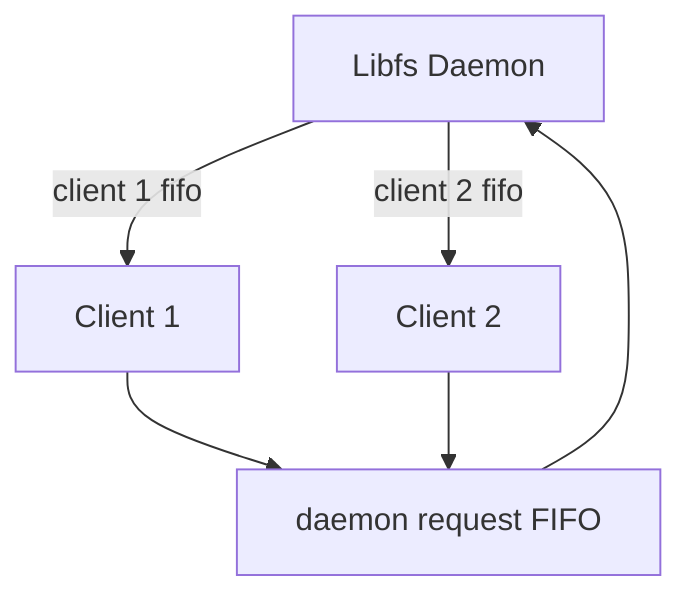
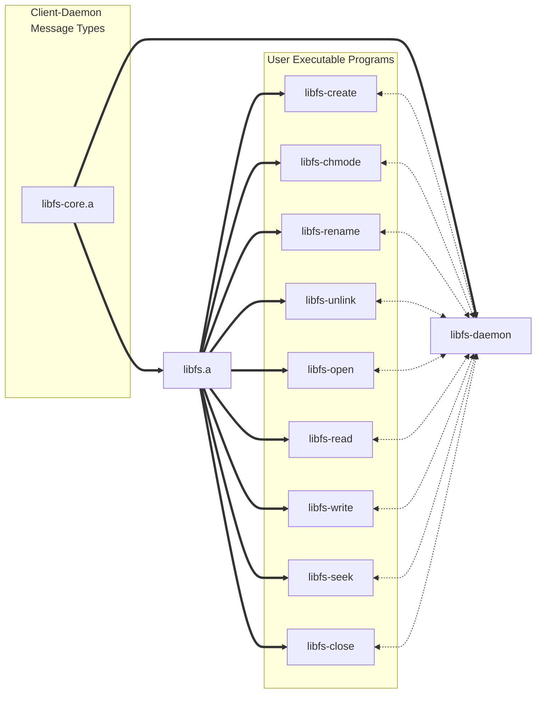

# Temat zadania
Napisać bibliotekę implementującą prosty system plików z operacjami zdefiniowanymi niżej.

Wariant: **W11 + W22**

## Założenia podstawowe:

- Biblioteka statyczna (.o lub .a), nagłówek .h oraz serwis (demon) [można też zrealizować jako bibliotekę .so]
- Pliki przechowywane są w jednym katalogu (struktura płaska, brak podkatalogów)
- Tylko pliki zwykłe (regular)
- Funkcje (działanie funkcji wynika z jej nazwy przez analogię do podobnej funkcji systemowej):

```c
fd_type libfs_create(char *name, long mode); // libfs_open nie tworzy pliku

int libfs_chmode(char *name, long mode);

int libfs_rename(char *oldname, char *newname);

int libfs_unlink(char *name);

fd_type libfs_open(char *name, int flags); // flagi: O_RD, O_WR, O_RDWR

int libfs_read(fd_type fd, char *buf, unsigned int size);

int libfs_write(fd_type fd, char *buf, unsigned int size);

int libfs_seek(fd_type fd, long int offset); // offset + lub - od akt. pozycji

int libfs_close(fd_type fd);
```

- Dodatkowo:
    - Kod powrotu - analogicznie do funkcji systemowych, dodatkowo zmienna `libfs_errno` powinna być ustawiana analogicznie do tego, jak dzieje się to dla zmiennej `errno`.
    - W razie wątpliwości dotyczących zachowania danej funkcji, należy przyjąć w miarę możności zachowanie maksymalnie zbliżone do odpowiadającej funkcji systemowej.
    - O ile w wariancie nie podano inaczej, kontrola praw dostępu odbywa się poprzez standardowe mechanizmy systemu, demon działa z tymi samymi uprawnieniami co użytkownik. Obsługę uprawnień należy przeanalizować i opisać.
    - Pliki mogą (ale nie muszą) być przechowywane w dedykowanym katalogu demona (alternaywnie: w pamięci).

## Wariant implementacyjny
Implementację komunikacji pomiedzy biblioteką a serwisem należy zrealizować poprzez **potoki nazwane (FIFO)**


## Wariant funkcjonalny
Dodatkowo należy zaimplementować:

- Dodać obsługę funkcji typu `stat()` oraz wynikających z niej atrybutów: wielkości, znaczników czasu.
- Dodać obsługę funkcji analogicznej do `link()`/`symlink()`

## Testowanie
Testy wymagają napisania programu lub programów (i ewentualnie skryptów) pokrywajacych funkcjonalność, przypadki brzegowe, obsługę błędów, itp.

Testy mogą zawierać prosty tekstowy interpreter pozwalający na uruchamianie poszczególnych funkcji w trybie konwersacyjnym. Dozwolone jest też napisanie szeregu prostych programów testowych, w takim przypadku zalecane jest stworzenie skryptów parametryzujących różne wywołania takich programów.

### Miejsce realizacji:
Dowolny system Unix/Linux zgodny z POSIX

<!-- TODO: -->

# Interpretecja treści zadania
Zdecydowaliśmy się przechowywać pliki w określonej z góry lokalizacji na dysku. Jest ona unikalna dla użytkownika, tworzona w jego katalogu domowym w ukrytym katalogu `$HOME/.local/state/libfs`.

## Opisy funkcji
<!-- wymaganych oraz dodatkowych -->

**Stwórz plik**
```c
fd_type libfs_create(char *name, long mode);
```

**Zmień uprawnienia do pliku**
```c
int libfs_chmode(char *name, long mode);
```

**Zmień nazwę pliku**
```c
int libfs_rename(char *oldname, char *newname);
```
**Usuń nazwę i ewentualnie plik, do którego się odnosi**
```c
int libfs_unlink(char *name);
```

**Otwórz isniejący plik**

Wspieramy flagi biblioteczne:

- O_RD
- O_WR
- O_RDWR

<!-- - najpierw sprawdzamy czy plik istnieje, dopiero później wykonujemy open -->
```c
fd_type libfs_open(char *name, int flags);
```

**Odczyt z deskryptora pliku**

```c
int libfs_read(fd_type fd, char *buf, unsigned int size);
```

**Zapis do deskryptora pliku**

```c
int libfs_write(fd_type fd, char *buf, unsigned int size);
```

**Zmień położenie przesunięcia w czasie odczytu/zapisu do pliku**

Położenie zmieniane relatywnie do aktualnej pozycji w źródle.

```c
int libfs_seek(fd_type fd, long int offset);
```

**Zamknięcie deskryptora pliku**

```c
int libfs_close(fd_type fd);
```

**Pobranie statusu pliku**

`struct libfs_stat_t` jest okrojoną wersją `struct stat` ze standardów. Usunięte są pola nam niepotrzebne, np. device ID lub user ID bądź group ID. Zakładamy że nasz system plików jest płaski, tzn. bez podkatalogów i istnieje w predefiniowanym miejscu na dysku. Jako że daemon pracuje z uprawnieniami użytkownika wykonującego do niego zapytania, pliki użytkownika biblioteki muszą znajdować się w miejscu w pełni dostępnym dla daemona, co ogranicza nas do `$HOME` użytkownika. Dane te byłyby więc stałe między plikami.

Nie planujemy powielać informacji o plikach w pamięci demona - `libfs_stat` będzie mapowała istniejącą informację o pliku z systemu plików na naszą strukturę zdefiniowaną w bibliotece.

```c
struct libfs_stat_t {
   ino_t     st_ino;         /* System Inode number */
   mode_t    st_mode;        /* File type and mode */
   nlink_t   st_nlink;       /* Number of hard links */
   off_t     st_size;        /* Total size, in bytes */
   blksize_t st_blksize;     /* Block size for filesystem I/O */
   blkcnt_t  st_blocks;      /* Number of 512B blocks allocated */

   struct timespec st_atim;  /* Time of last access */
   struct timespec st_mtim;  /* Time of last modification */
   struct timespec st_ctim;  /* Time of last status change */
};

int libfs_stat(const char *restrict pathname,
               struct libfs_stat_t *restrict statbuf);
```

**Dodanie nowej nazwy do isniejącego pliku**

```c
int libfs_link(const char* source, const char* destination);
```

**Dodanie aliasu do ścieżki pliku**

```c
int libfs_symlink(const char* source, const char* destination);
```

# Opis funkcjonalny "Black-Box"
<!-- Krótki opis funkcjonalny – “black-box”, najlepiej w punktach. -->

- Udostępniamy prosty system plików w jednym katalogu bez podkatalogów.
- Obsługuje tylko pliki zwykłe, dowiązania twarde i symboliczne.
- Dostępne operacje to: tworzenie, zmiana trybu, zmiana nazwy, usuwanie, otwieranie, odczyt i zapis danych, przesunięcie wskaznika pozycji, zamknięcie pliku, pobranie statusu, dodanie twardych oraz symbolicznych dowiązań.
- Funkcje zwracają kod powrotu i ustawiają zmienną libfs_errno, która informuje o błędach.
- Obsługa uprawnień jest zgodna z mechanizmami systemowymi, systemy plików nie są dzielone między użytkownikami.

# Opis rozwiązania

<!-- Opis i analizę poprawności stosowanych: struktur danych, metod komunikacja, metod synchronizacji, moduły wraz z przepływem sterowania i danych między nimi. -->

<!-- Podział na moduły i strukturę komunikacji między nimi (silnie wskazany rysunek). -->

## Struktury danych

Przyjęliśmy następującą konwencję nazewnictwa:

- `Request` są to komunikaty klienta do demona
- `Response` są to odpowiedzi demona do klienta

Dla każdej funkcji stworzymy struktury, posiadają pola, odpowiadające parametrom funkcji. Przykładowe struktury:
```c
typedef struct libfs_request_create {
    char* name;
    u32 mode;
} libfs_request_create_t;

typedef struct libfs_request_write {
    fd_type fd;
    usize size;
    u8* data;
} libfs_request_write_t;
```

Struktury, przed wysłaniem do demona Pakowane są do standardowego formatu request'u:

```c
typedef struct libfs_request {
    libfs_request_kind_t kind;
    pid_t sender;
    usize data_size;
    u8* data;
} libfs_request_t;
```

Podobnie sprawa wygląda w drugą stronę, jednakże w tym wypadku nie potrzebujemy informacji o tym, od którego procesu dana informacja pochodzi.

```c
typedef struct libfs_response {
    int status;
    usize data_size;
    u8* data;
} libfs_response_t;
```

## Metody Komunikacji i Synchronizacji
<!-- Koncepcja realizacji współbieżności. -->



Demon blokuje się na kolejce, czeka, aż coś zostanie w niej umieszczone, jeżeli coś znajduje się w kolejce, wczytuje strukturę, która się w niej znajduje. Następuje zapis do pamięci, parsowanie oraz wykonują się odpowiednie przetworzenia. Na koniec na podstawie sendera wysyła odpowiedź do odpowiedniej klienckiej kolejki. Proces ten jest powtarzany.

Komunikacja w dwie strony dobywa się poprzez przesłanie poniższych struktur:

- Struktura przesyłana do demona to `libfs_request`
- Struktura przysłana do klienta to `libfs_response`

Demon posiada jedną kolejkę (daemon request FIFO) z której odczytuje zapisane przez klientów zapytania.

Każdy z klientów posiada dedykowaną dla siebie kolejkę FIFO (client x fifo) z której będzie czytał zapisane przez Demona odpowiedzi.

Klienckie funkcje biblioteczne będą odpowiedzialne, za utworzenie własnych kolejek, podobnie w przypadku demona, który również będzie tworzył własną kolejkę.

Klient przetwarza zapytania, następnie odsyła je z powrotem do demona.

Synchronizacja na poziomie kolejek klienckich nie jest potrzebna, ponieważ tylko jeden proces zapisuje/odczytuje z kolejki. Natomiast w przypadku kolejki demona, musimy zapewnić synchronizację zapisów, do tego wykorzystamy funkcję `flock()`, dzięki której jesteśmy w stanie zablokować pisane na tym deskryptorze. Kolejne procesy, które będą chciały zacząć pisać zostaną zablokowane na tej funkcji.

## Moduły



Rozwiązanie podzielmy na dwie osobne biblioteki `libfs-core.a` oraz `libfs.a`.

W bibliotece `libfs-core.a` zawrzemy funkcjonalność dzieloną przez demona oraz programy klienckie.

Metody, które nie są wymagane przez demona, ale za to są potrzebne do działania programów klienckich zostaną umieszczone w bibliotece `libfs.a`.

Biblioteka `libfs-core.a` będzie zawierała struktury `request` oraz `response`, a także dedykowane metody do serializacji i deserializacji.

Biblioteka `libfs.a` będzie zawierała obsługę odpowiedzi, a także obsługę wartości errno.

Obsługę zapytań `request` zostanie zaimplementowania wewnątrz programu demona, dlatego też nie jest wymagane, aby znalazła się ona w oddzielnej bibliotece.

## Przykładowe wykorzystanie

Przykładowe użycie kilku z tych programów (sprowadzających się z grubsza do wywołania odpowiedniej funkcji biblioteki `libfs.a`) z poziomu bash'a:

```bash
libfs-create hello.txt
fdw=$(libfs-open -w hello.txt)
libfs-write $fdw "Hello"
libfs-close $fdw

fdr=$(libfs-open -r hello.txt)
content=$(libfs-read $fdr)
libfs-close $fdr

echo $content
```

<!-- Opis najważniejszych rozwiązań funkcjonalnych wraz z uzasadnieniem (opis protokołów, struktur danych, kluczowych funkcji, itp.) -->

<!-- Szczegółowy opis interfejsu użytkownika. -->


# Implementacja
<!-- Zarys koncepcji implementacji (język, biblioteki, narzędzia, etc.). -->

**Język**: C++17

**Biblioteki**:

- `unistd.h`

**Narzędzia**:

- **Kompilator**: GCC, kompilowanie z `-Wall -Werror -Wextra -Wconversion -Wpedantic`
- **Formatowanie**: `clang-format`
- **Build System**: GNU `make`. Każdy pod-projekt (`libfs`, `libfs-core`, `libfs-daemon` itd.) ma własny `Makefile`, plus główny, agregujący je.
- **Edytor**: VS Code, neovim

Biblioteka będzie budowana jako archiwum `.a`.

<!-- Opis wykorzystanych narzędzi, itp. -->

# Testowanie

<!-- Zarys koncepcji testów -->
Do testowania służyć będą małe programy wołające funkcje biblioteczne. Aby kompleksowo przetestować poszczególne przypadki, każdy przypadek użycia będzie reprezentowany skryptem bash, który będzie uruchamiać małe programy w zadanej kolejności.

Skrypty te będą wywoływane przez główny "runner", `test.sh`, który będzie porównywać ich output i exit code z oczekiwanymi.


<!--  Szczegółowy opis testów i wyników testowania -->


<!-- Należy pamiętać, że nie mamy opisywać kwestii znanych i omawianych na wykładzie, np. zasady funkcjonowania API i funkcji systemowych, standardowych narzędzi programistycznych, itp. -->
